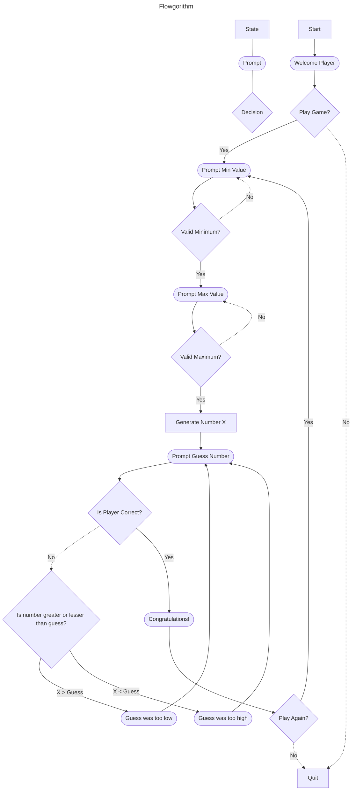

Text Description of Steps

**Start State**
- Welcome Player and prompt if they would like to play
	- No, quit the game
	- Yes, advance to Min Value Prompt

**Prompt Player for Minimum Value**
- Check input for validity ( must be a number
	- If invalid,  prompt the player for a valid Minimum input
	- If valid, advance to Max Value Prompt

**Prompt Player for Maximum Value**
- Check input for validity (must be number, must be greater than Min)
	- If invalid, prompt player for valid Maximum input
	- If valid, advance to Generating the Number

**Generate the random number, X, within the min and max values given by the player**

**Prompt Player Guess**
- Check input for validity (Must Be a number)
	- If invalid, prompt player for valid guess
	- If valid, advance to comparing guess to generated number X

**Compare Guess to X**
- if X > Guess, Prompt Player that Guess was too low
- if X < Guess, Prompt Player that Guess was too high
- if X == Guess, Advance to Congratulate Player

**Congratulate Player and advance to play again prompt**

**Prompt Player to play again**
- If No, Quit Game
- If Yes, Advance to Prompt for min value. 